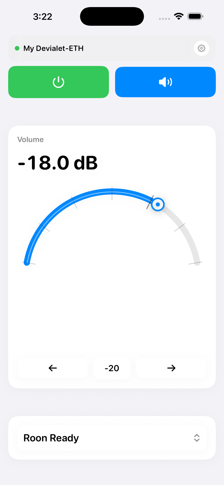
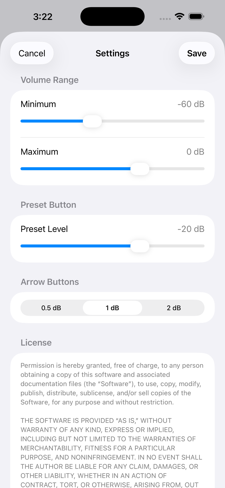

# ExPro: A modern iOS controller app for Devialet Expert Pro amplifiers

This project provides a native iOS implementation for controlling Devialet Expert Pro amplifiers.

 

## Feature coverage

- Discovery by listening on UDP `45454`
- Status decode parity (device name, power, mute, channel, volume, dynamic inputs)
- Command send on UDP `45455` with 4x send reliability, packet counters, CRC16
- Power on/off/toggle
- Mute/unmute/toggle
- Volume set with clamp to `[-96, 0]` and 0.5 dB steps
- Channel switch with non-linear mapping and slot 1 hardcoded bytes (`0x3F 0x80`)
- Cached amplifier IP and cached status via `UserDefaults`
- Optimistic UI updates and 1s refresh loop while app is active

## Add to Xcode and build

### Option A: Use generated Xcode project

1. Download everything (hint: on Github, click the down arrow on the green "Code" button,  choose "Download ZIP", and then unzip the archive).
2. Double-click the file "DevialetExpertControl.xcodeproj" to open it in Xcode.
3. Go to the "Signing & Capabilities" tab and add your Apple account under the Team dropdown.
4. Connect your iPhone to your Mac with a cable
5. In the Privacy & Security settings on the phone, turn on "Developer Mode"
6. Build and run on your phone (Command-R)

Problems with signing or getting the app on your phone? Please consult Google or a local chatbot.


### Option B: Generate project with XcodeGen

```bash
brew install xcodegen
cd ios
xcodegen generate
open DevialetExpertControl.xcodeproj
```

The generator spec is in `ios/project.yml`.

After generating, continue as above.

### Option C: Manual project setup

1. Open Xcode and create a new iOS App project (SwiftUI, iOS 17+).
2. Add `DevialetExpertControlApp/*.swift` files and `DevialetExpertControlApp/Info.plist` to the app target.
3. Add local Swift package dependency pointing to this `ios/` folder.
4. Link the package product `DevialetCore` to your app target.
5. Ensure the target uses the provided local network usage description in `Info.plist`.

## Tests

Run from this folder:

```bash
cd ios
swift test
```

## License

This documentation and code is provided as-is for educational and personal use. Devialet is a trademark of Devialet SAS. This project is not affiliated with or endorsed by Devialet.
